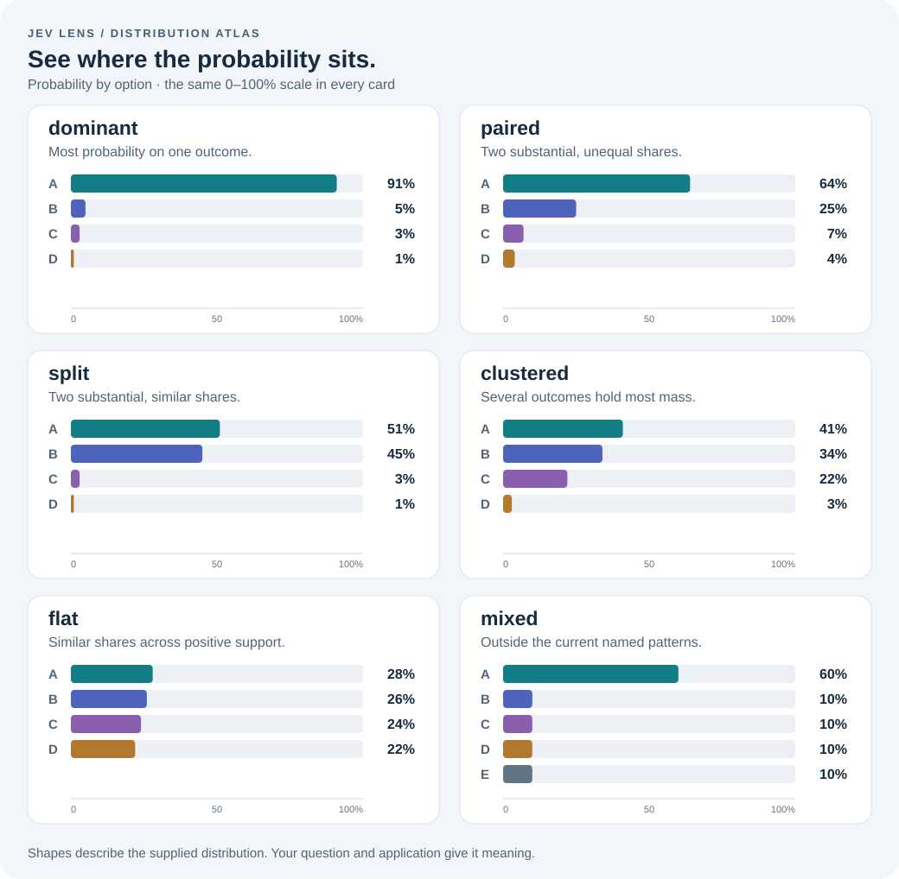

# jev-patterns

[](https://github.com/rodrigopsasaki/jev-patterns/releases/tag/v0.2.0)
[](https://github.com/rodrigopsasaki/jev-patterns/actions/workflows/ci.yml)
[](LICENSE)


**Give a probability distribution a vocabulary. Keep its meaning in context.**

Turn Jev responses into recognizable shapes, typed observations, and application code you can read. Describe concentration, preserve alternatives, and decide what to do in your own code.

Independent TypeScript library. ESM. No runtime dependencies or network calls. **v0.2.0** includes individual-answer inspection and is the first npm release. The API and thresholds remain provisional.

## Start with the whole distribution

A customer cannot sign in. Your model was asked which **one** explanation best fits the message:

<!-- example:quickstart -->
```ts
import { analyze } from 'jev-patterns';

const distribution = analyze({
  password_reset: 0.51,
  account_locked: 0.45,
  outage: 0.03,
  other: 0.01,
});

distribution.shape;                       // 'split'
distribution.first.option;                // 'password_reset'
distribution.gap;                         // approximately 0.06
distribution.metrics.firstTwoProbability; // 0.96
distribution.prominent.count;             // 2 prominent alternatives
```

The first option is available, but so is the fact that almost as much probability sits on the second. Option names remain a TypeScript literal union throughout the result.

## Start with one answer

An SDK, adapter, batch, or saved record may give you an individual answer. `inspectAnswer()` describes it without requiring a model name, usage counts, or a response envelope.

<!-- example:inspection -->
```ts
import { inspectAnswer } from 'jev-patterns';

const inspected = inspectAnswer({
  type: 'choice',
  choice: 'S1',
  confidence: null,
  probabilities: { S1: 0.51, S2: 0.45, none: 0.04 },
});

if (inspected.kind === 'available') {
  inspected.answer.shape;       // 'split'
  inspected.answer.prominent;   // S1 and S2, with their probabilities
  inspected.answer.confidence;  // null: provider confidence was unavailable
  inspected.answer.first.option; // typed as 'S1' | 'S2' | 'none'
}
```

| Result kind | Meaning |
| --- | --- |
| `available` | `.answer` contains the typed observations and a `.raw` snapshot. |
| `missing` | The supplied answer was `undefined`. |
| `unavailable` | A Choice or Score omitted its distribution or supplied `null`; `.raw` preserves the supplied answer. |
| `invalid` | The supplied data cannot be interpreted; `.issues` provides structured paths, codes, and messages. |

Missing confidence becomes `null` in the inspected view. It never borrows a number from the distribution. Noul keeps `.yes`, `.no`, and `.distribution`; Score keeps `.score`, `.confidence`, `.legend`, and `.distribution`. Choice exposes the distribution directly, including `.is()` and `.match()`.

`parse(response)` remains strict about Jev's full wire response. `analyze(probabilities)` remains the direct probability-map API. All three share the same descriptive rules. Expected input problems become inspection outcomes; invalid options and exceptions from executable inputs such as throwing getters still throw. See the [individual-answer contract](docs/answer-inspection.md) and [batch example](examples/answer-batch.ts).

## Six ways probability can be distributed



| Shape | Example (%) | What it describes |
| --- | --- | --- |
| `dominant` | 91 / 5 / 3 / 1 | Most probability sits on one outcome. |
| `paired` | 64 / 25 / 7 / 4 | Two substantial, unequal shares. |
| `split` | 51 / 45 / 3 / 1 | Two substantial, similar shares. |
| `clustered` | 41 / 34 / 22 / 3 | Several outcomes hold most of the probability. |
| `flat` | 28 / 26 / 24 / 22 | Similar probabilities across positive support. |
| `mixed` | 60 / 10 / 10 / 10 / 10 | No named pattern matches the current profile. |

These are descriptive heuristics over the supplied probabilities. `mixed` makes room for distributions the vocabulary does not capture. The actual probabilities, ties, and remaining mass stay available under every shape.

## The question changes the interpretation

**“Which one?” and “Which ones?” need different inputs.**

| What you ask | What the scores describe | A useful application response |
| --- | --- | --- |
| “Which explanation best fits this login failure?” | Alternatives competing for one selection | Ask for a detail that distinguishes the main alternatives. |
| “Which article is the best starting point?” | Alternatives competing for one starting point | Fetch several plausible starting points before composing a response. |
| “Does this ticket mention billing? Does it request a refund?” | A separate yes/no proposition for each label | Suggest several labels, each from its own yes probability. |

In a Choice response, `billing: 0.51, refund: 0.45, other: 0.04` does **not** establish that both billing and refund apply. It describes the model's allocation across options for the question it received. The concepts can overlap in the real world; the question still requests one selection.

For multiple applicable labels, ask one Noul question per label. `billing: 0.94` and `refund: 0.89` can both be high. Do not normalize those scores into one distribution: each describes a different proposition. Separate questions do not imply statistical independence.

This follows Jev's documented [Choice](https://docs.typesafe.ai/primitives/choice) and [Noul](https://docs.typesafe.ai/primitives/noul) semantics. The library cannot recover a missing question or turn concentration into evidence of correctness. A dominant distribution can still favor the wrong answer, and the right answer might not be among the supplied options.

## Things you can build

### Ask a useful follow-up

In a support UI, map the shape to a view. For a split result, offer the two main explanations as clarification options. These handlers define this application's behavior; the library calls exactly one.

<!-- example:support -->
```ts
import { analyze } from 'jev-patterns';

const issue = analyze({
  password_reset: 0.51,
  account_locked: 0.45,
  outage: 0.03,
  other: 0.01,
});

const view = issue.match({
  dominant: (d) => ({ kind: 'suggest', option: d.uniqueMaximum.option } as const),
  paired: (d) => ({ kind: 'compare', options: d.pair.map((x) => x.option) } as const),
  split: (d) => ({ kind: 'clarify', options: d.pair.map((x) => x.option) } as const),
  clustered: (d) => ({ kind: 'choose-topic', options: d.prominent.items.map((x) => x.option) } as const),
  flat: () => ({ kind: 'ask-for-details' } as const),
  mixed: () => ({ kind: 'manual-review' } as const),
});

// { kind: 'clarify', options: ['password_reset', 'account_locked'] }
// A UI can now ask: “Do you need to reset your password, or is your account locked?”
```

Every shape is required. Each callback receives a narrowed type: `dominant` has a non-null `uniqueMaximum`; `paired` and `split` have a two-item `pair`. The return type is the union of your view objects. Promises and exceptions are preserved too.

### Fetch a shortlist before answering

Ask which **one** help article is the best starting point. If probability is spread across several, retrieve a shortlist rather than build the answer around the first article alone.

<!-- example:retrieval -->
```ts
import { massSet } from 'jev-patterns';

const shortlist = massSet({
  reset_2fa: 0.41,
  lost_phone: 0.34,
  backup_codes: 0.22,
  other: 0.03,
}, 0.8);

const pagesToFetch = shortlist.options.map((item) => item.option);
// ['reset_2fa', 'lost_phone', 'backup_codes']

shortlist.mass;         // approximately 0.97
shortlist.excludedMass; // approximately 0.03
```

This returns a ranked prefix reaching the requested model probability mass within numeric tolerance, including ties at its boundary. Here two articles cover only 75%, so the third is included. The 80% target is this application's retrieval policy; it is not a measured recall guarantee or proof that those articles contain the answer.

### Suggest every applicable label

Ask “Does this ticket mention billing?”, “Does it request a refund?”, and “Does it mention a login problem?” as separate Noul questions. Here is a fabricated decoded response:

<!-- example:labels -->
```ts
import { parse } from 'jev-patterns';

const response = parse({
  model: 'synthetic',
  usage: { input_tokens: 0, output_tokens: 0 },
  answers: {
    billing: { type: 'noul', noul: 0.94 },
    refund: { type: 'noul', noul: 0.89 },
    login: { type: 'noul', noul: 0.08 },
  },
});

// Illustrative application policy, to evaluate on your own labeled examples.
const suggestAt = 0.8;
const suggestedLabels = Object.entries(response.answers)
  .filter(([, answer]) => answer.yes >= suggestAt)
  .map(([label]) => label);
// ['billing', 'refund']

response.answers.billing.distribution.shape; // 'dominant', toward yes
response.answers.login.distribution.shape;   // 'dominant', toward no
```

Both the strong yes and the strong no are concentrated. **Use `.yes` to suggest a label; `dominant` alone does not tell you the direction.** Each Noul retains `.yes`, `.no`, and its own binary `.distribution`. There is no combined shape for this collection of labels in v0.

### Express a more specific policy

Shapes are useful shorthand. Predicates let you state your application's requirements directly:

<!-- example:predicates -->
```ts
import { allOf, analyze, dominant, gapAtLeast } from 'jev-patterns';

const route = analyze({ billing: 0.91, refunds: 0.05, login: 0.03, other: 0.01 });
const routingPolicy = allOf(dominant({ floor: 0.9 }), gapAtLeast(0.3));
const meetsRoutingPolicy = route.is(routingPolicy); // true
```

Predicates are ordinary functions. Compose them with `allOf`, `anyOf`, and `not`, or supply your own. They can overlap, and changing a predicate does not relabel the distribution. These cutoffs are an example policy to evaluate against the costs of incorrect routing.

## Connect a Jev response

Replace a synthetic response with your decoded API result: `const response = parse(await jevJudge(callContext))`. `jevJudge` stands for your application's Jev client call; it is not exported by this package.

| Answer kind | What `parse()` exposes |
| --- | --- |
| Choice | Shape, measurements, `.match()` and `.is()` directly on the answer, alongside the original `.choice`, `.confidence`, and `.raw`. |
| Noul | `.yes`, `.no`, and the yes/no view under `.distribution`. |
| Score | Level legend, provider score/confidence, `.expectedLevel`, and the categorical view under `.distribution`. |

With typed input, known question IDs, answer kinds, and option names survive parsing. With unknown JSON or an open dictionary, check for a missing answer and narrow its kind before use. Invalid input throws a `TypeError`. Input is preserved, including raw snapshots and provider metadata.

Score levels are ordered. A categorical shape by itself cannot distinguish probability on adjacent levels from probability on distant levels; retain the legend and inspect the levels for that use case.

## What v0 includes

| API | Purpose |
| --- | --- |
| `analyze(probabilities, options?)` | Describe one normalized probability map. Values must be in `[0, 1]` and sum to 1 within the reported tolerance. |
| `parse(response, options?)` | Validate decoded Jev JSON and add typed distribution views. |
| `.match(handlers)` | Map all six shapes to your application's values or actions. |
| `.is(predicate)` | Test structure using a supplied function. |
| `massSet(probabilities, targetMass)` | Keep a ranked prefix reaching a requested mass within numeric tolerance, retaining boundary ties. |

`sorted`, `first`, `second`, `maxima`, `uniqueMaximum`, and `gap` expose rank and ties. Sorting tied entries never creates a unique maximum. `prominent` groups positive-probability outcomes at least a configurable fraction of the maximum, within numeric tolerance; `massSet` groups by accumulated mass.

`metrics.effectiveOptions` provides Shannon and Simpson effective counts: how spread out this one distribution is, expressed on the scale of equally weighted alternatives. It does **not** estimate how many answers are true or how many labels apply. `prominent.count` is also a descriptive count, not a validity count.

The applied heuristics and numerical tolerances are recorded under `.profile` (`descriptive-v2`). Thresholds remain provisional. Changes to classification semantics require a new profile version. Multi-label aggregation, calibration, and ordinal distance analysis remain outside the current API.

Explore the [public types](src/model.ts), [design](docs/proposal.md), and [examples](examples/shapes.ts) in the repository. Development files are excluded from the package archive.

## Looking ahead: task verbs

The next layer could expose verbs such as `classify`, `detect`, `label`, `rank`, `retrieve`, and `verify`. Each would wrap Jev calls with an inspectable, versioned task recipe: useful defaults you can adopt, configure, or recreate. An optional receipt would accompany the task result with the questions, observed responses and policy rules that produced it.

This is a V2 design direction, not an available v0 API. The key boundary is a pure interpreter shared by wrapped calls and saved responses; distribution shapes remain observations underneath the task policy. See the [task recipe proposal](docs/task-recipes.md) in the repository for example signatures, receipt semantics and the seams v0 keeps open.

## Install

Node 24.14+ and TypeScript 5.9.3+ are the current support floor. Install the compiled package from [npm](https://www.npmjs.com/package/jev-patterns):

```sh
npm install jev-patterns
```

The [GitHub release](https://github.com/rodrigopsasaki/jev-patterns/releases/tag/v0.2.0) also provides a compiled tarball and checksum. The earlier v0.1.0 release was distributed through GitHub only.

To work from source:

```sh
git clone https://github.com/rodrigopsasaki/jev-patterns.git
cd jev-patterns
```

Then:

```sh
npm ci --ignore-scripts
npm run demo
npm pack
```

In a separate project, install the resulting `jev-patterns-0.2.0.tgz` by its local path. The public import is `jev-patterns`. The tarball includes compiled ESM JavaScript, declarations, this README, and its visual assets.

## Development and checks

```sh
npm run check                     # changed worktree: Biome + affected checks
npm run check -- --since main     # branch changes from the merge base
npm run check:plan                # inspect selection without running checks
npm run test:watch                # affected tests while editing
npm run check:full                # complete coverage and installed-package checks
```

Tests fabricate Jev responses and exercise mathematical invariants, numeric boundaries, malformed inputs, typed consumers, and package contracts. All TypeScript examples in this README execute and typecheck against the installed tarball.

Ordinary PRs select affected checks. Broad changes, `main` pushes, release tags, and manual runs select the full Node/platform matrix. See the [live CI runs](https://github.com/rodrigopsasaki/jev-patterns/actions/workflows/ci.yml). See [testing](docs/testing.md), [contributing](CONTRIBUTING.md), [changes](CHANGELOG.md), and the [release policy](docs/release-policy.md).

MIT licensed. Independent project, not affiliated with TypeSafe AI.
